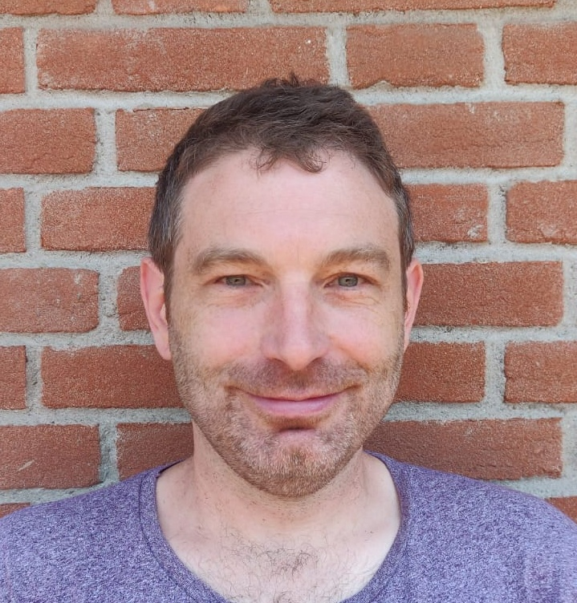

I'm an assistant professor at Heriot-Watt University, Edinburgh, where I'm working on mitigation of online harms in [the Interaction Lab](https://sites.google.com/site/hwinteractionlab/).

I'm part funded by the EPSRC projects [Equally Safe Online (EP/W025493/1)](https://sites.google.com/view/equallysafeonline/home). 

I previously worked on the EPSRC project [Designing Conversational Assistants to Reduce Gender Bias (EP/T023767/1)](https://sites.google.com/view/convai-gender-bias).

I'm an organiser of the workshops [NLPerspectives](https://nlperspectives.di.unito.it/) and [CounterSpeech for Online Harms](https://sites.google.com/view/cs4oa).

You can find my publications [here](https://scholar.google.com/citations?user=AHLy4VgAAAAJ&hl=en).

You can take a look at my CV here (coming soon)

### Contact:

email: g.abercrombie@hw.ac.uk

Follow me on [Bluesky](https://bsky.app/profile/gavina.bsky.social).
