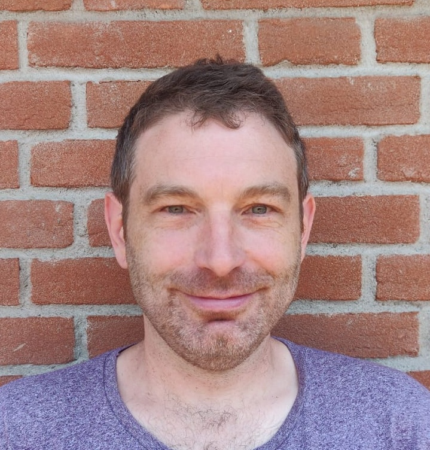

I'm an assistant professor at Heriot-Watt University, Edinburgh, where I'm working on mitigation of online harms in [the Interaction Lab](https://sites.google.com/site/hwinteractionlab/).

I'm part funded by the EPSRC project [Equally Safe Online (EP/W025493/1)](https://sites.google.com/view/equallysafeonline/home). 

I previously worked on the EPSRC project [Designing Conversational Assistants to Reduce Gender Bias (EP/T023767/1)](https://sites.google.com/view/convai-gender-bias).

I'm an organiser of the workshops [NLPerspectives](https://nlperspectives.di.unito.it/) and [CounterSpeech for Online Harms](https://sites.google.com/view/cs4oa).

You can find my publications [here](https://scholar.google.com/citations?user=AHLy4VgAAAAJ&hl=en).

You can find my CV [here](files/AcademicCV2024.pdf).

### Contact:

email: g.abercrombie@hw.ac.uk

Follow me on [Bluesky](https://bsky.app/profile/gavina.bsky.social).

### News:

**July 2025**

I'm co-organising and presenting a [tutorial on NLP for Counterspeech against Hate and Misinformation](https://sites.google.com/view/nlp4csham/) at this year's ACL conference.

**December 2024**

Tanvi Dinkar and I gave a talk on using participatory design for NLP at [University of Edinburgh ILCC](https://informatics.ed.ac.uk/ilcc)

**September 2024**

Our paper ['Mirages'](https://aclanthology.org/2023.emnlp-main.290/) was cited by the AI Safety Institute as motivation for a [survey](https://www.aisi.gov.uk/work/should-ai-systems-behave-like-people) on public attitudes to anthropomorphic technology.

I was invited to take part in a forum on combating disinformation and hate speech, organised by the Spanish government's Ministry of National Security at the Universidad Complutense de Madrid.

**July 2024**

I gave my first keynote talk at the [Scottish Informatics & Computer Science Alliance](https://www.sicsa.ac.uk/) PhD Conference, University of Aberdeen.

**June**

My MSc student Aashima Poudhar presented her [paper on counterspeech strategies](https://aclanthology.org/2024.woah-1.20/) at WOAH.

I presented our [survey and how-to guide on NLP for counterspeech](https://aclanthology.org/2024.findings-naacl.221/) with Helena Bonaldi at NAACL in Mexico City.

______________________________________________________________

'I use technology in order to hate it properly.' Nam June Paik
